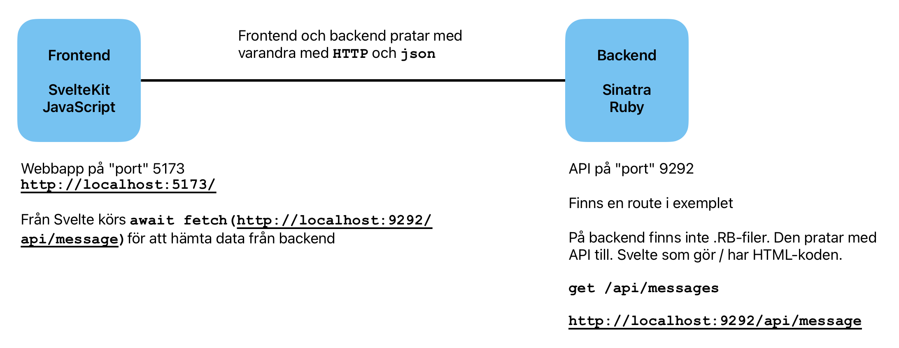

# Exempel Ruby backend - SvelteKit frontend

  
*Backendn - Frontend*

## Frontend
SvelteKit webbapp

Om du inte har någon SvelteKit-app igång installera med: `npx sv create sveltekit-app`

Från frontend-mappen starta SvelteKit med: `npm run dev -- --open`

## Backend 
Ruby, Sinatra, SQLite
När den startas sätts en minimal API upp

Installera med `bundle` och starta med `rake dev`. Båda från backend-mappen.